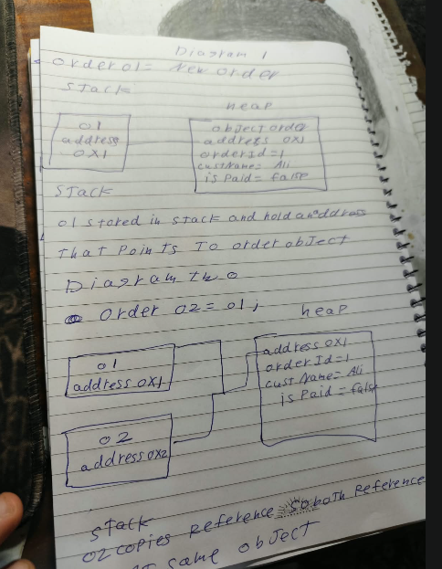
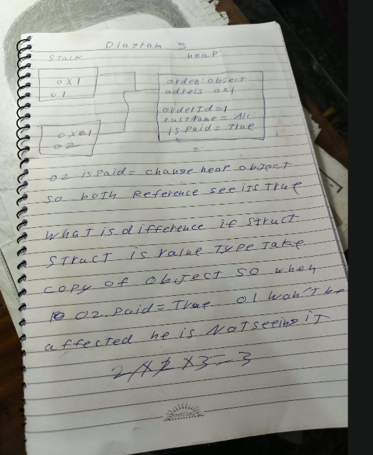

# C# Basics — Learning by Practice

This repository documents part of my C# learning journey. The goal of this assignment is not only to write code that runs, but to apply the fundamentals and understand what happens behind the code while a program is running.

The project is a console application divided into small demonstrations. Each part focuses on one core concept and shows its behavior through code, printed output, written explanations, and memory diagrams.

## What This Assignment Builds

This assignment builds the foundation needed to write and understand larger C# applications. It connects four important ideas:

1. How a C# project is organized and built.
2. How values are stored, converted, and processed.
3. How value types and reference types behave in memory.
4. How scope and operators control what the program can access and calculate.

Understanding these ideas makes later topics such as object-oriented programming, collections, exception handling, and application architecture much easier to learn.

## Concepts Applied

### 1. Project Structure

The project demonstrates the purpose of the main files and generated folders in a C# application:

- `CSharpBasicsAssignment.csproj` defines the project settings, target framework, and compiler options.
- `Program.cs` contains the program entry point and runs each demonstration.
- `Order.cs` contains the `Order` reference type used in the memory experiments.
- `bin/` stores the compiled output.
- `obj/` stores intermediate files created during the build process.

This creates a clear understanding of what happens when a C# project is built and run, instead of treating the Run button as a black box.

### 2. Variables, Types, and Conversions

The project uses common C# types such as `int`, `long`, `double`, `float`, `decimal`, `bool`, `char`, `string`, and `var`.

It also demonstrates:

- Implicit conversion when the destination type can safely hold the value.
- Explicit casting when a conversion may lose information.
- The difference between truncation and rounding.
- Integer division compared with floating-point division.
- Converting text into numbers with `Parse` and `TryParse`.
- Why some numeric conversions require an explicit cast.

These concepts help prevent data loss, unexpected results, and runtime errors when working with user input or calculations.

### 3. Boxing and Unboxing

Boxing stores a value type, such as an `int`, inside an `object`. Unboxing extracts the value back into its original value type.

This experiment explains that the value must be unboxed using the correct type. It also helps clarify the difference between placing a value type inside `object` and storing an existing reference-type object inside `object`.

### 4. Value Types vs. Reference Types

The `Point` struct is used to demonstrate value-type behavior. When one `Point` variable is assigned to another, the values are copied. Changing the second variable does not affect the first one.

The `Order` class demonstrates reference-type behavior. Assigning one `Order` variable to another copies the reference, not the whole object. Both variables therefore point to the same object, and a change made through one reference is visible through the other.

This is one of the most important foundations in C# because it explains why some assignments create independent values while others share the same object.

### 5. Stack and Heap

The memory diagrams show the relationship between local reference variables and an object:

- The reference variables hold addresses.
- The `Order` object contains its field values.
- Two variables can hold references to the same object.
- Updating the shared object is visible through both references.

<p align="center">
  
  
</p>

The full written explanation is available in [`STACK_HEAP.md`](submission/assignment/STACK_HEAP.md).

### 6. Scope

The project demonstrates field, method, and block scope. Scope determines where a variable can be accessed and how long its name remains available in the code.

For example, a variable declared inside a loop cannot be used after the loop ends. Understanding scope helps prevent naming conflicts and keeps data limited to the part of the program that actually needs it.

### 7. Compound and Bitwise Operators

Compound operators such as `+=`, `-=`, `*=`, `/=`, and `%=` provide shorter forms of common assignment operations.

The project also applies the bitwise operators `&`, `|`, and `^` to integers. These operators work on the individual bits of a number and are different from the logical operators `&&` and `||` used with Boolean conditions.

## Project Structure

```text
submission/
└── assignment/
    ├── assets/
    │   ├── stack_heap_diagrams_1.png
    │   └── stack_heap_diagrams_2.png
    ├── ANSWERS.md
    ├── CSharpBasicsAssignment.csproj
    ├── Order.cs
    ├── Program.cs
    ├── README.md
    └── STACK_HEAP.md
```

## How to Run

Requirements:

- .NET 9 SDK
- Visual Studio 2022, Visual Studio Code, or another C# editor

From the repository root, run:

```bash
cd submission/assignment
dotnet run
```

## Main Takeaway

This assignment connects C# syntax with the way the language works internally. By combining code, console output, written answers, and memory diagrams, it develops a practical understanding of types, conversions, references, memory, scope, and operators—the foundation for continuing into more advanced C# and .NET development.
